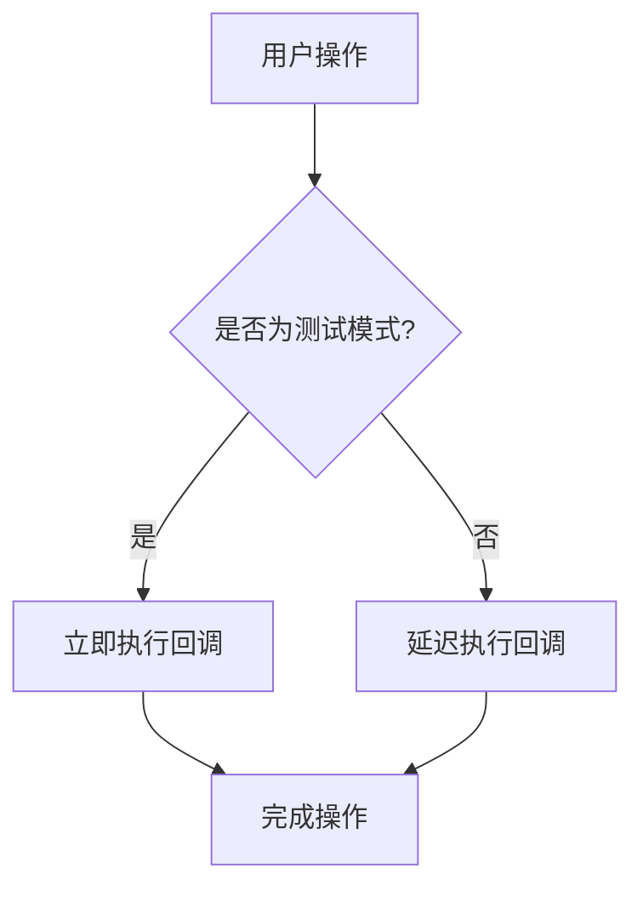
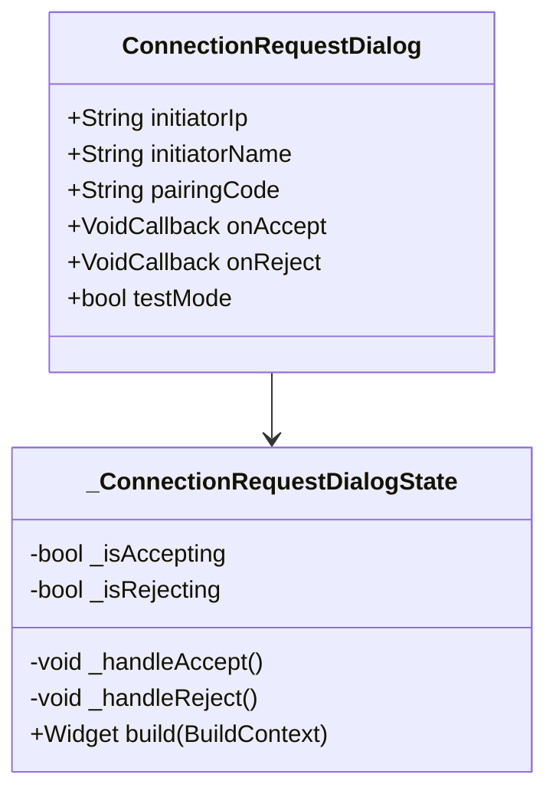

### 1. 目的

* 本文档面向开发人员和测试人员。
* 文档涵盖对 `ConnectionRequestDialog` 组件的测试性改进设计。
* 这些改进对于确保组件的可靠测试和持续集成至关重要。

### 2. 文档结构

#### 概述

**项目背景**：
在 Bifrost Transfer 应用中，`ConnectionRequestDialog` 组件用于显示来自其他设备的连接请求，并允许用户接受或拒绝这些请求。该组件在接受或拒绝操作时包含延迟，以提供更好的用户体验，但这些延迟在自动化测试中导致了计时器问题。

**项目目标**：
改进 `ConnectionRequestDialog` 组件的可测试性，同时保持其在生产环境中的用户体验。

**技术选型**：
* Flutter 测试框架
* 状态管理：StatefulWidget 本地状态

#### 详细设计

**功能模块**：

**模块划分**：
`ConnectionRequestDialog` 组件负责：
1. 显示连接请求信息（发起方设备名称、IP地址和配对码）
2. 提供接受和拒绝操作的按钮
3. 在操作过程中显示加载状态

**模块交互**：
组件通过回调函数与父组件交互：
* `onAccept`：用户接受连接请求时调用
* `onReject`：用户拒绝连接请求时调用

**流程图**：
```mermaid
flowchart TD
    A[显示连接请求对话框] --> B{用户操作}
    B -->|点击接受| C[显示"正在连接..."状态]
    B -->|点击拒绝| D[显示"正在拒绝..."状态]
    C -->|延迟500ms| E[调用onAccept回调]
    D -->|延迟300ms| F[调用onReject回调]
```

**异常处理**：

**异常处理流程**：
在测试环境中，延迟可能导致测试超时或计时器未完成的问题。解决方案是在测试模式下跳过延迟。

**异常处理流程图**：


**数据设计**：

**数据模型**：
组件接收以下数据：
* `initiatorIp`：发起方IP地址（字符串）
* `initiatorName`：发起方设备名称（字符串）
* `pairingCode`：配对码（字符串）
* `testMode`：测试模式标志（布尔值，默认为false）

**数据流**：
1. 父组件传递连接请求数据和回调函数
2. 用户交互触发状态更新
3. 根据测试模式决定是否延迟执行回调

**类设计**：

**类结构**：


**实现方式**：
* 使用 `StatefulWidget` 管理组件内部状态
* 通过 `testMode` 参数控制测试行为
* 在处理方法中根据 `testMode` 决定是否跳过延迟

#### 其他

**性能优化**：
通过条件检查避免在测试环境中不必要的延迟，提高测试执行速度。

**单元测试**：
测试用例包括：
1. 验证对话框正确显示发起方信息和配对码
2. 验证点击接受按钮调用 `onAccept` 回调
3. 验证点击拒绝按钮调用 `onReject` 回调
4. 验证按钮在处理中被禁用

在所有测试中，`testMode` 参数设置为 `true`，以避免延迟导致的测试问题。 