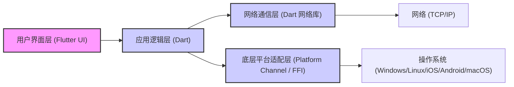

以需求文档来设计技术架构文档

1. 确定技术栈，我们使用dart + Flutter

2. 部署平台目前为Windows, Linux，后续考虑iOS, Android, Mac

3. 架构图使用mermaid绘制，不要给一张图片格式的

<需求文档>

<需求文档>

=== user 2 ===
mermaid报错了
Error: Error: Parse error on line 2:
...raph LR A[用户界面层 (Flutter UI)] --> B(
----------------------^
Expecting 'SQE', 'DOUBLECIRCLEEND', 'PE', '-)', 'STADIUMEND', 'SUBROUTINEEND', 'PIPE', 'CYLINDEREND', 'DIAMOND_STOP', 'TAGEND', 'TRAPEND', 'INVTRAPEND', 'UNICODE_TEXT', 'TEXT', 'TAGSTART', got 'PS'

=== ai output ===

非常感谢您的反馈！我理解您希望架构图以 Mermaid 格式提供，而不是静态图片。这样您可以更方便地编辑和调整架构图。

我已经更新了技术架构文档，将架构概览图部分替换为 Mermaid 代码。您现在可以直接复制 Mermaid 代码到任何支持 Mermaid 语法的工具（例如：Markdown 编辑器、在线 Mermaid Live Editor 等）中渲染出架构图。

以下是更新后的技术架构文档，架构概览图部分已替换为 Mermaid 代码：

**技术架构文档**

**项目名称：** 虹桥 (Bifrost) 局域网文件传输助手

**1. 引言**

**1.1 文档目的**

本文档旨在描述“虹桥”(Bifrost) 局域网文件传输助手的技术架构，为开发团队提供清晰的技术指导，确保软件的设计与开发符合需求文档中定义的功能和非功能需求。

**1.2 项目背景**

“虹桥”(Bifrost) 旨在解决用户在不同操作系统设备间进行文件传输时遇到的操作复杂、速度慢等问题。通过开发一款跨平台、便捷高效的局域网文件传输助手，提升用户在局域网环境下的文件共享效率。

**1.3 技术选型**

*   **编程语言：** Dart
*   **UI 框架：** Flutter

**选择 Dart + Flutter 的理由：**

*   **跨平台能力：** Flutter 框架具备优秀的跨平台特性，能够快速构建同时运行于 Windows、Linux、iOS、Android 和 macOS 等多个平台的应用，符合项目跨平台的需求。
*   **快速开发与高效性能：** Flutter 拥有热重载、丰富的组件库和高效的渲染引擎，能够显著提升开发效率，并保证应用性能。
*   **现代化的用户界面：** Flutter 可以创建美观、流畅的用户界面，提升用户体验，符合易用性需求。
*   **社区支持与生态系统：** Dart 和 Flutter 拥有活跃的社区和不断完善的生态系统，为项目的开发和维护提供了良好的支持。

**2. 架构概览**

“虹桥”(Bifrost) 采用分层架构设计，主要分为以下几个核心层：

*   **用户界面层 (UI Layer)：**  使用 Flutter 构建，负责用户交互和功能入口。
*   **应用逻辑层 (Application Logic Layer)：**  使用 Dart 编写，处理业务逻辑、数据处理和流程控制。
*   **网络通信层 (Network Communication Layer)：**  使用 Dart 的网络库实现，负责设备发现、连接、数据传输等网络操作。
*   **底层平台适配层 (Platform Adaptation Layer)：**  使用 Flutter 的 Platform Channel 或 Dart FFI (Foreign Function Interface)  进行平台特定功能的适配，例如文件系统访问、网络接口调用等。

**架构概览图：**

**3. 组件设计**

**3.1 用户界面层 (UI Layer)**

*   **技术选型：** Flutter
*   **主要功能组件：**
    *   **设备列表界面：**  展示局域网内设备，提供手动连接入口。
    *   **文件选择界面：**  浏览本地文件系统，选择待传输文件和文件夹。
    *   **传输界面：**  显示传输进度、速度、剩余时间，以及断点续传控制。
    *   **文本传输界面：**  提供文本输入框和文本显示区域。
    *   **设置界面：**  设备重命名、接收路径设置、历史记录查看、插件管理等。
    *   **提示与反馈：**  各种操作提示、错误信息、完成提示等。

**3.2 应用逻辑层 (Application Logic Layer)**

*   **技术选型：** Dart
*   **主要模块：**
    *   **设备管理模块：**
        *   负责维护设备列表，处理设备连接、断开、配对逻辑。
        *   实现设备重命名功能。
    *   **文件传输管理模块：**
        *   处理文件选择、文件夹传输、多文件传输、拖拽传输逻辑。
        *   实现文件传输进度监控、断点续传、完成提示、传输确认等功能。
        *   负责与网络通信层交互，进行数据传输。
    *   **文本传输管理模块：**
        *   处理文本输入、纯文本传输逻辑。
        *   支持插件扩展文本预览功能。
    *   **设置管理模块：**
        *   处理接收路径设置、历史记录管理、插件管理等功能。
    *   **插件管理模块 (为未来扩展预留)：**
        *   负责插件的加载、卸载、管理，以及插件市场入口管理。
    *   **错误处理模块：**
        *   集中处理应用中的各种异常情况，提供友好的错误提示和日志记录。

**3.3 网络通信层 (Network Communication Layer)**

*   **技术选型：** Dart `dart:io` 库 (Socket, HttpServer 等)
*   **主要功能：**
    *   **设备发现 (手动)：**  根据需求文档，不自动发现设备，主要实现手动输入 IP 地址或设备名称进行连接的功能。可以使用 UDP 广播或组播进行可选的设备发现扩展。
    *   **设备连接与配对：**  使用 TCP Socket 建立设备之间的连接，实现设备配对确认机制。
    *   **数据传输：**  使用 TCP Socket 进行文件和文本数据的可靠传输。
    *   **传输协议：**  自定义应用层协议，基于 TCP，定义消息格式，包括：
        *   连接请求/响应消息
        *   配对请求/响应消息
        *   文件传输请求/响应消息
        *   文本传输消息
        *   进度更新消息
        *   完成消息
        *   错误消息等
    *   **断点续传机制：**  在协议中加入断点续传相关字段，例如已传输字节数、文件分块传输等。

**3.4 底层平台适配层 (Platform Adaptation Layer)**

*   **技术选型：** Flutter Platform Channel 或 Dart FFI
*   **主要适配功能：**
    *   **文件系统访问：**  调用平台 API 实现文件和文件夹的浏览、选择、读取等操作。
    *   **网络接口调用：**  获取网络状态、监听网络变化等。
    *   **操作系统特定功能：**  例如，未来可能需要调用特定平台的通知 API 实现后台静默传输的通知。

**4. 部署架构**

*   **部署平台：** Windows, Linux (初始版本), 未来扩展至 iOS, Android, macOS
*   **部署方式：**
    *   **Windows/Linux：**  打包为可执行文件，用户下载后直接运行。
    *   **iOS/Android/macOS：**  通过各自平台的应用商店或安装包进行分发。
*   **运行环境依赖：**
    *   **Dart Runtime Environment：**  Flutter 应用自带 Dart 运行时环境，用户无需额外安装。
    *   **网络环境：**  局域网环境 (Wi-Fi 或有线网络)，支持 TCP/IP 协议。

**5. 非功能需求实现**

**5.1 性能需求**

*   **传输速度：**  利用局域网高速传输特性，优化数据传输效率，例如使用 Buffered Socket 进行数据读写，减少系统调用开销。
*   **资源占用：**  在开发过程中注意代码优化，避免内存泄漏，合理使用资源，例如在传输大文件时使用流式传输，降低内存占用。
*   **启动速度：**  优化 Flutter 应用的启动性能，例如进行代码裁剪、优化依赖加载等。

**5.2 可靠性需求**

*   **稳定性：**  进行充分的测试，包括单元测试、集成测试、系统测试，确保软件在各种场景下稳定运行。
*   **兼容性：**  在需求文档中指定的操作系统版本上进行兼容性测试，确保软件在不同版本上都能良好运行。
*   **错误处理：**  在应用逻辑层和网络通信层中加入完善的错误处理机制，捕获异常并给出友好的错误提示，记录详细的日志信息。

**5.3 易用性需求**

*   **用户界面：**  遵循 Material Design 或 Cupertino 设计规范，设计简洁直观、操作流畅的用户界面。
*   **操作便捷：**  简化操作流程，例如使用拖拽传输、一键连接等功能，降低用户使用门槛。
*   **提示信息：**  提供清晰的操作提示和错误信息，引导用户正确操作和解决问题。
*   **多语言支持：**  在未来版本中考虑添加多语言支持，满足不同语言用户的需求。

**5.4 可维护性需求**

*   **代码规范：**  严格遵循 Dart 编码规范和 Flutter 最佳实践，编写清晰、易读、易维护的代码。
*   **模块化设计：**  采用模块化设计，将应用拆分成独立的模块，降低模块之间的耦合度，提高代码的可维护性和可扩展性。
*   **日志记录：**  在关键模块和关键流程中加入详细的日志记录，方便问题排查和分析。

**6. 边界条件与异常场景处理**

*   **大文件传输：**  针对大文件传输进行优化，例如使用流式传输、分块传输、断点续传等技术，提升大文件传输的稳定性和效率。
*   **设备连接失败：**  当设备连接失败时，提供清晰的错误提示信息，引导用户检查网络连接或手动输入正确的 IP 地址或设备名称。
*   **网络中断：**  实现断点续传功能，在网络中断后能够自动或手动恢复传输，避免重复传输。
*   **传输失败：**  当文件传输失败时，提供详细的错误信息，例如网络错误、文件不存在、权限不足等，帮助用户定位问题。
*   **低带宽环境：**  在低带宽环境下，自动调整传输策略，例如降低并发连接数、限制传输速率等，保证应用的可用性。

**7. 安全性考虑**

*   **局域网环境：**  “虹桥”(Bifrost) 主要用于局域网环境，默认情况下安全性较高。
*   **数据加密 (可选)：**  在未来版本中，可以考虑增加数据加密功能，例如使用 TLS 或其他加密算法对传输的数据进行加密，提升数据传输的安全性。
*   **设备配对确认：**  采用设备配对确认机制，防止未授权设备连接和数据访问。

**8. 未来扩展方向**

*   **插件市场：**  构建插件市场，允许开发者扩展 “虹桥”(Bifrost) 的功能，例如文件预览、格式转换、云同步等。
*   **更多的平台支持：**  扩展支持更多的操作系统平台，例如 macOS、鸿蒙 OS 等。
*   **P2P 直连：**  在未来版本中，可以考虑支持 P2P 直连模式，在没有中心服务器的情况下实现设备发现和文件传输。
*   **云同步集成：**  与云存储服务集成，实现局域网和云端的文件同步和备份。
*   **多语言支持：**  支持更多的语言，满足全球用户的需求。