# 技术方案设计文档 - Bifrost 虹桥

## 1. 文档概述

### 1. 目的

* 本设计文档面向开发人员、测试人员和项目经理，提供 Bifrost 虹桥跨平台文件传输工具的详细技术设计。
* 文档涵盖整体架构、模块设计、UI/UX 设计和数据流设计等方面。
* 本文档将指导开发团队实现一个高效、安全、易用的局域网文件传输工具，确保开发过程中的一致性和质量。

### 2. 文档结构

* **概述**：
    * **项目背景**：Bifrost 虹桥旨在解决用户在局域网内跨平台设备间快速、便捷、安全地共享文件的需求。
    * **项目目标**：提供简洁的用户界面和高效的传输协议，帮助用户提升工作效率，优化文件共享体验。
    * **技术选型**：
        * **Flutter 框架**（版本 3.0.6+）：跨平台开发框架，支持 Windows、macOS、Linux、Android、iOS 等多平台。
        * **Provider 状态管理**：轻量级状态管理方案，适合中小型应用。
        * **Socket 通信**：使用 Dart 的 Socket API 实现设备间实时通信，支持可靠的 TCP 连接。
        * **依赖注入**：使用 get_it 包实现依赖注入，提高代码的可测试性和可维护性。
        * **文件分块传输**：通过分块传输提高大文件传输的效率和稳定性。
        * **设备配对机制**：通过 IP 地址和配对码确保连接安全性。
        * **网络适配器识别**：使用 NetworkInterface API 获取真实网卡信息，过滤虚拟网卡。
        * **日志系统**：使用 logging 包实现全面的日志记录，便于调试和问题排查。

* **详细设计**：
    * **功能模块**：设备连接管理、文件传输、文本传输、传输历史记录等。
    * **异常处理**：网络异常、连接失败、文件读写错误等情况的处理流程。
    * **数据设计**：设备信息、传输任务、传输历史等数据模型设计。
    * **类设计**：基于接口的设计模式，确保代码的可扩展性和可维护性。

* **其他**：
    * **安全性设计**：局域网传输安全、连接验证机制。
    * **性能优化**：文件分块传输、并发传输控制。
    * **单元测试**：关键功能的测试策略和测试用例。
    * **风险评估**：潜在风险和应对措施。

## 2. 系统架构设计

### 2.1 系统架构图

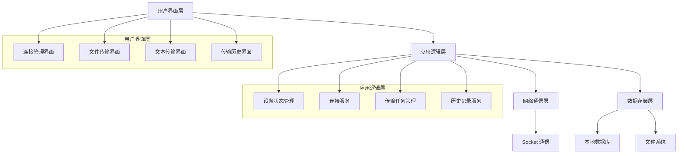

### 2.2 技术栈

* **前端框架**：Flutter 3.0.6+
* **状态管理**：Provider 6.1.1
* **本地存储**：Shared Preferences 2.2.2
* **网络通信**：Dart Socket API
* **日志记录**：Logging 1.2.0
* **UI 组件**：Material Design、Font Awesome Flutter 10.7.0

### 2.3 关键技术

* **Socket 通信**：使用 Dart 的 Socket API 实现设备间的实时通信，支持文件和文本的高效传输。
* **Provider 状态管理**：采用 Provider 模式管理应用状态，实现 UI 和业务逻辑的分离，提高代码可维护性。
* **文件分块传输**：将大文件分块传输，提高传输效率和稳定性，支持断点续传。
* **设备配对机制**：通过 IP 地址和配对码实现设备的安全连接，防止未授权访问。
* **网络适配器识别**：通过 NetworkInterface API 获取真实网卡信息，过滤虚拟网卡，确保使用物理网卡的 IP 地址进行通信。

## 3. 主要功能设计

### 3.1 设备连接管理

#### 3.1.1 功能描述

设备连接管理模块负责在局域网内建立两台设备之间的连接，为后续的文件和文本传输提供基础。该模块包括手动IP连接、连接状态显示、已连接设备信息显示等功能。

#### 3.1.2 实现方案

**网络信息获取**：

- 使用 Dart 的 NetworkInterface API 获取设备的网络接口信息
- 过滤掉虚拟网卡（如 VMware、WSL、VirtualBox 等）和非活动网卡
- 优先使用物理网卡的 IPv4 地址，确保在局域网内可被其他设备访问
- 获取操作系统的主机名作为设备名称
- 在网络信息获取失败时提供合理的默认值和错误处理

**连接建立方式**：

- 采用Socket通信方式，基于TCP协议建立可靠连接
- 使用配对码机制进行双向验证，确保连接安全
- **所有连接操作采用异步实现，不阻塞UI主线程**
- **设置连接请求和配对确认超时机制，避免无限等待**
- **支持用户随时取消连接请求**

**连接状态管理**：

- 未连接：初始状态，显示"未连接"
- 连接中：发起连接请求后，显示"连接中..."
- 等待确认：设备可达且生成配对码后，显示"等待确认..."
- 已连接：连接成功建立后，显示"已连接"
- 连接失败：连接请求被拒绝或超时，显示"连接失败"

**通信协议设计**：

- **端口设置**：
  - **监听端口**：8000，所有设备在此端口监听连接请求
  - **数据传输端口**：8001，用于文件和文本数据传输
  - **控制端口**：8002，用于传输控制命令（如暂停、取消等）

- **消息数据结构**：
  - 所有消息采用JSON格式，包含以下基本字段：
    ```json
    {
      "type": "消息类型",
      "timestamp": "时间戳",
      "data": {
        // 具体消息内容
      }
    }
    ```
  - **消息类型**：
    - `CONNECTION_REQUEST`：连接请求
    - `CONNECTION_RESPONSE`：连接响应
    - `PAIRING_CONFIRMATION`：配对确认
    - `DISCONNECT`：断开连接
    - `PING`：心跳检测
    - `PONG`：心跳响应

- **连接请求消息**：
  ```json
  {
    "type": "CONNECTION_REQUEST",
    "timestamp": "2023-02-26T14:30:00.000Z",
    "data": {
      "deviceName": "发送方设备名称",
      "deviceId": "设备唯一标识",
      "pairingCode": "123456",
      "protocolVersion": "1.0"
    }
  }
  ```

- **连接响应消息**：
  ```json
  {
    "type": "CONNECTION_RESPONSE",
    "timestamp": "2023-02-26T14:30:05.000Z",
    "data": {
      "accepted": true/false,
      "deviceName": "接收方设备名称",
      "deviceId": "设备唯一标识",
      "reason": "拒绝原因（仅在accepted为false时）"
    }
  }
  ```

- **配对确认消息**：
  ```json
  {
    "type": "PAIRING_CONFIRMATION",
    "timestamp": "2023-02-26T14:30:10.000Z",
    "data": {
      "confirmed": true/false,
      "pairingCode": "123456"
    }
  }
  ```

- **断开连接消息**：
  ```json
  {
    "type": "DISCONNECT",
    "timestamp": "2023-02-26T14:30:15.000Z",
    "data": {
      "reason": "断开原因（可选）"
    }
  }
  ```

- **心跳检测消息**：
  ```json
  {
    "type": "PING",
    "timestamp": "2023-02-26T14:30:20.000Z",
    "data": {}
  }
  ```

- **心跳响应消息**：
  ```json
  {
    "type": "PONG",
    "timestamp": "2023-02-26T14:30:20.100Z",
    "data": {}
  }
  ```

- **超时设置**：
  - **连接请求超时**：10秒，超时后自动取消连接请求
  - **配对确认超时**：30秒，超时后自动取消配对过程
  - **心跳检测间隔**：5秒，定期发送心跳检测消息
  - **心跳响应超时**：3秒，超过3秒未收到响应视为连接异常
  - **连接重试次数**：3次，连接失败后自动重试的最大次数
  - **重试间隔**：2秒，连接失败后重试的间隔时间

- **连接建立流程**：
  1. 发起方检查接收方IP地址的8000端口是否可达
  2. 发起方生成6位数字配对码
  3. 发起方向接收方发送`CONNECTION_REQUEST`消息
  4. 接收方接收到请求后，显示配对码给用户确认
  5. 用户确认后，接收方发送`CONNECTION_RESPONSE`消息（accepted=true）
  6. 发起方接收到响应后，发送`PAIRING_CONFIRMATION`消息
  7. 双方建立连接，开始定期发送心跳检测消息
  8. 任何一方可发送`DISCONNECT`消息主动断开连接

**连接流程**：

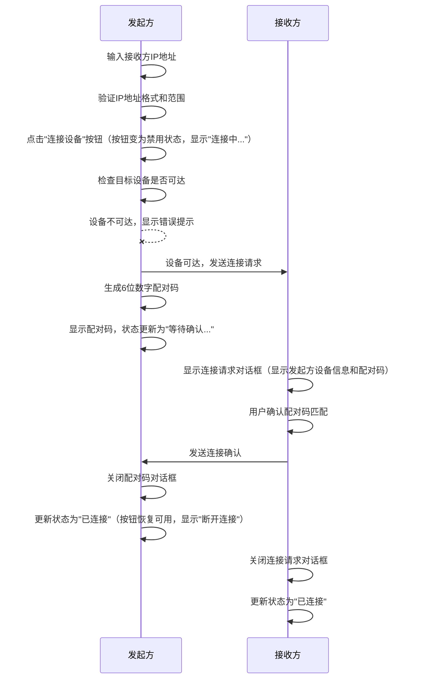

**IP地址验证流程**：

```mermaid
graph TD
    A[用户输入IP地址] --> B{格式验证}
    B -->|不符合格式| C[显示"IP地址格式无效"错误]
    B -->|符合格式| D{范围验证}
    D -->|超出范围| E[显示"IP地址段超出有效范围"错误]
    D -->|范围有效| F[IP地址验证通过]
    C --> G[禁用连接按钮]
    E --> G
    F --> H[启用连接按钮]
```

**连接超时和取消机制**：

```mermaid
graph TD
    A[发起连接请求] --> B[启动连接请求超时计时器]
    B --> C{10秒内收到响应?}
    C -->|是| D[取消超时计时器]
    C -->|否| E[触发连接请求超时]
    D --> F[生成配对码]
    F --> G[启动配对确认超时计时器]
    G --> H{30秒内收到确认?}
    H -->|是| I[取消超时计时器]
    H -->|否| J[触发配对确认超时]
    E --> K[更新状态为"连接失败"]
    J --> K
    I --> L[更新状态为"已连接"]
    M[用户点击取消按钮] --> N[取消所有超时计时器]
    N --> O[中断连接过程]
    O --> P[更新状态为"未连接"]
```

#### 3.1.3 用户界面与交互

**发起方（发送端）操作流程**：

1. 用户在连接区域输入接收方IP地址
   - **IP输入框始终可见，但在连接过程中会被禁用**
   - 输入框提供IP地址格式验证，无效格式时输入框边框变红并显示提示
   - **实时验证每个IP地址段是否在0-255范围内**
   - **超出范围时显示具体错误提示**
2. 点击"连接设备"按钮
   - **按钮点击后文本变为"取消"，允许用户随时取消连接过程**
   - 状态栏更新为"连接中..."，颜色变为黄色
   - **系统首先检查目标设备是否可达**
   - **设备不可达时，立即显示错误提示，不生成配对码**
3. 设备可达后，系统生成6位数字配对码
   - 状态栏更新为"等待确认..."，颜色保持黄色
   - **显示配对码和30秒倒计时**
   - **"取消"按钮保持可见，允许用户随时取消连接请求**
4. 连接成功后：
   - **配对码信息保持显示**
   - 状态栏更新为"已连接"，颜色变为绿色
   - 显示已连接设备信息
   - **按钮文本变为"连接"，恢复可用状态**
5. 连接失败情况：
   - 设备不可达：**立即显示"无法连接到目标设备"提示**，不生成配对码
   - 连接请求超时：**10秒后显示"连接请求超时"提示**
   - 配对确认超时：**30秒后显示"等待配对确认超时"提示**
   - 被拒绝：**显示"连接被拒绝"提示**
   - 用户取消：状态恢复为"未连接"
   - 以上所有情况，按钮恢复为"连接"，状态栏显示相应状态，颜色变为红色

**接收方（接收端）操作流程**：

1. 用户启动应用，状态栏显示本机IP和设备名
2. 接收到连接请求时，弹出连接请求对话框
   - 对话框显示发起方设备信息、配对码、"接受"和"拒绝"按钮
   - **对话框为模态对话框，用户必须做出选择才能继续操作**
   - **对话框中的配对码使用大号字体和特殊样式突出显示，便于用户核对**
   - **对话框不可通过点击背景关闭，必须通过按钮操作**
3. 用户确认配对码匹配后，点击"接受"按钮
   - **按钮点击后立即变为禁用状态，显示"正在连接..."**
   - **系统向发起方发送接受连接响应消息，包含本机设备名称和IP地址**
   - **连接成功后对话框自动关闭**
   - 状态栏更新为"已连接"，颜色变为绿色
   - 显示已连接设备信息
   - **主界面IP输入框被禁用，按钮文本变为"断开连接"**
4. 用户点击"拒绝"按钮
   - **系统向发起方发送拒绝连接响应消息**
   - **对话框立即关闭**
   - 状态栏保持"未连接"状态
   - **主界面保持原状态，用户可以继续其他操作**

**配对确认/拒绝消息处理流程**：

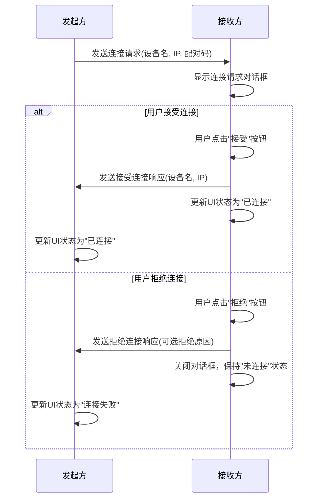

**接收方UI状态变化**：

1. **未连接状态**：
   - 状态栏显示"未连接"，颜色为红色
   - IP输入框可用，按钮文本为"连接"

2. **收到连接请求**：
   - 弹出连接请求对话框
   - 对话框显示发起方设备信息和配对码
   - 提供"接受"和"拒绝"按钮

3. **接受连接后**：
   - 对话框关闭
   - 状态栏更新为"已连接"，颜色变为绿色
   - 显示已连接设备信息
   - IP输入框被禁用
   - 按钮文本变为"断开连接"

4. **拒绝连接后**：
   - 对话框关闭
   - 状态栏保持"未连接"状态
   - IP输入框和按钮保持原状态

**消息处理细节**：

1. **接受连接响应消息**：
   - 消息类型：`CONNECTION_RESPONSE`
   - 消息内容：
     ```json
     {
       "accepted": true,
       "deviceName": "接收方设备名",
       "deviceIp": "接收方IP地址"
     }
     ```
   - 处理流程：
     - 接收方发送此消息后，更新自身状态为"已连接"
     - 发起方接收到此消息后，取消配对确认超时计时器
     - 发起方更新状态为"已连接"，显示接收方设备信息

2. **拒绝连接响应消息**：
   - 消息类型：`CONNECTION_RESPONSE`
   - 消息内容：
     ```json
     {
       "accepted": false,
       "deviceName": "接收方设备名",
       "deviceIp": "接收方IP地址",
       "rejectReason": "拒绝原因(可选)"
     }
     ```
   - 处理流程：
     - 接收方发送此消息后，关闭连接请求对话框，保持"未连接"状态
     - 发起方接收到此消息后，取消配对确认超时计时器
     - 发起方更新状态为"连接失败"，显示"连接被拒绝"提示
     - 发起方断开Socket连接

#### 3.1.4 异常处理

- **IP地址无效**：
  - **格式无效**：当用户输入的IP地址不符合"xxx.xxx.xxx.xxx"格式时
    - 输入框边框变红
    - 显示错误提示"请输入有效的IP地址格式"
    - 禁用"连接设备"按钮
  - **范围无效**：当IP地址的任一段不在0-255范围内时
    - 输入框边框变红
    - 显示错误提示"请输入有效的IP地址（每段为0-255的数字）"
    - 禁用"连接设备"按钮

- **设备不可达**：
  - 当目标IP不可达时（无法建立TCP连接）
    - 显示错误提示"无法连接到目标设备，请检查IP地址是否正确"
    - 状态栏更新为"连接失败"，颜色变为红色
    - **IP输入框保持可见，按钮文本变为"连接"**

- **连接超时**：
  - **连接请求超时**：发送连接请求后10秒内未收到响应
    - 自动取消连接请求
    - 显示错误提示"连接请求超时，请检查目标设备是否在线"
    - 状态栏更新为"连接失败"，颜色变为红色
    - **IP输入框保持可见，按钮文本变为"连接"**
  - **配对确认超时**：生成配对码后30秒内未收到确认
    - 自动取消连接请求
    - 显示错误提示"等待配对确认超时，请重新发起连接"
    - 状态栏更新为"连接失败"，颜色变为红色
    - **IP输入框保持可见，按钮文本变为"连接"**

- **用户取消连接**：
  - 用户在连接过程中点击"取消"按钮
    - 立即中断连接过程
    - 取消所有超时计时器
    - 状态栏恢复为"未连接"
    - **IP输入框保持可见，按钮文本变为"连接"**

- **网络异常**：
  - 检测到网络异常时，自动断开连接
  - 显示"网络异常，连接已断开"提示
  - 状态栏更新为"未连接"
  - **IP输入框保持可见，按钮文本变为"连接"**
  - **所有网络操作设置超时机制（默认30秒）**

### 3.2 文件传输

#### 3.2.1 功能描述

文件传输模块负责在已连接的设备之间传输单个或多个文件、文件夹，支持显示传输进度、传输速度等信息。

#### 3.2.2 实现方案

**文件传输方式**：

- 采用Socket通信，基于TCP协议进行可靠传输
- 文件分块传输，支持大文件传输
- **采用异步传输机制，不阻塞UI主线程**
- **支持并行传输多个文件，提高传输效率**
- **连接建立后，发送文件无需接收方再次确认，直接开始传输**

**文件传输状态管理**：

- 等待中：文件已添加到传输队列，等待传输
- 传输中：文件正在传输
- 已完成：文件传输成功完成
- 失败：文件传输失败
- 已取消：用户取消文件传输

**文件传输流程**：

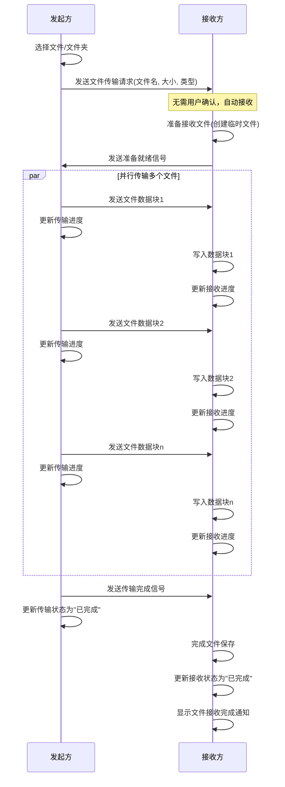

#### 3.2.3 用户界面与交互

**发起方（发送端）操作流程**：

1. 用户在已连接状态下，通过以下方式选择文件：
   - 点击"选择文件"按钮打开文件选择器
     - **按钮点击后显示短暂的按下效果**
     - **文件选择器打开时，按钮变为禁用状态**
     - **选择完成后，按钮恢复可用状态，并显示"已选择X个文件"的提示**
   - 拖拽文件到拖放区域
     - **拖拽过程中，拖放区域边框变为蓝色，背景色变浅**
     - **拖放完成后，显示"已添加X个文件"的提示**
2. 文件添加到传输列表后，自动开始传输
   - 传输列表显示每个文件的名称、大小、传输进度、状态
   - 进度条实时更新传输进度
   - 显示当前传输速度和预计剩余时间
3. 用户可以对传输任务进行操作：
   - 暂停：点击暂停按钮
     - **按钮点击后图标变为"继续"图标**
     - **进度条颜色变为灰色**
     - **状态文本变为"已暂停"**
   - 继续：点击继续按钮
     - **按钮点击后图标变为"暂停"图标**
     - **进度条颜色恢复为蓝色**
     - **状态文本变为"传输中"**
   - 取消：点击取消按钮
     - **弹出确认对话框"确定要取消传输吗？"**
     - **确认后，任务从列表中移除**
     - **或者状态变为"已取消"，进度条变为红色**
4. 传输完成后：
   - 进度条变为绿色，显示100%
   - 状态文本变为"已完成"
   - **显示"传输完成"的通知**

**接收方（接收端）操作流程**：

1. 用户在已连接状态下，自动接收文件
   - **无需用户确认，系统自动接收文件并保存到默认目录**
   - **接收开始时，状态栏显示"正在接收文件..."通知**
2. 接收过程中，传输列表显示：
   - 文件名称、大小、接收进度、状态
   - 进度条实时更新接收进度
   - 显示当前接收速度和预计剩余时间
3. 用户可以对接收任务进行操作：
   - 暂停：点击暂停按钮
     - **按钮点击后图标变为"继续"图标**
     - **进度条颜色变为灰色**
     - **状态文本变为"已暂停"**
   - 继续：点击继续按钮
     - **按钮点击后图标变为"暂停"图标**
     - **进度条颜色恢复为蓝色**
     - **状态文本变为"接收中"**
   - 取消：点击取消按钮
     - **弹出确认对话框"确定要取消接收吗？"**
     - **确认后，任务从列表中移除，删除已下载的临时文件**
4. 接收完成后：
   - 进度条变为绿色，显示100%
   - 状态文本变为"已完成"
   - **显示"文件接收完成"的通知，包含文件保存位置**
   - **提供"打开文件"和"打开所在文件夹"的快捷操作**

#### 3.2.4 异常处理

- **文件读取错误**：
  - 发送方无法读取文件时，显示错误提示"无法读取文件：[文件名]"
  - 传输任务状态更新为"失败"
  - 进度条变为红色
  - **提供"重试"按钮，点击后重新尝试传输**

- **文件写入错误**：
  - 接收方无法写入文件时，显示错误提示"无法写入文件：[文件名]"
  - 传输任务状态更新为"失败"
  - 进度条变为红色
  - **提供"重试"和"更改保存位置"按钮**

- **磁盘空间不足**：
  - 接收方磁盘空间不足时，显示错误提示"磁盘空间不足，无法接收文件"
  - 传输任务状态更新为"失败"
  - **提供"清理空间"和"更改保存位置"按钮**

- **网络中断**：
  - 传输过程中网络中断，显示错误提示"网络连接中断，传输暂停"
  - 传输任务状态更新为"已暂停"
  - **网络恢复后，提供"继续"按钮，支持断点续传**

### 3.3 文本传输

#### 3.3.1 功能描述

文本传输模块负责在已连接的设备之间传输文本内容，支持代码片段、日志等文本信息的快速共享。

#### 3.3.2 实现方案

**文本传输方式**：

- 采用Socket通信，基于TCP协议进行可靠传输
- 支持Unicode字符集，确保各种语言文本的正确传输
- **采用异步传输机制，不阻塞UI主线程**
- **连接建立后，发送文本无需接收方再次确认，直接开始传输**
- **文本大小限制为32KB，超过限制不允许发送**

**文本传输状态管理**：

- 等待中：文本已准备发送，等待传输
- 传输中：文本正在传输
- 已完成：文本传输成功完成
- 失败：文本传输失败

**文本传输流程**：

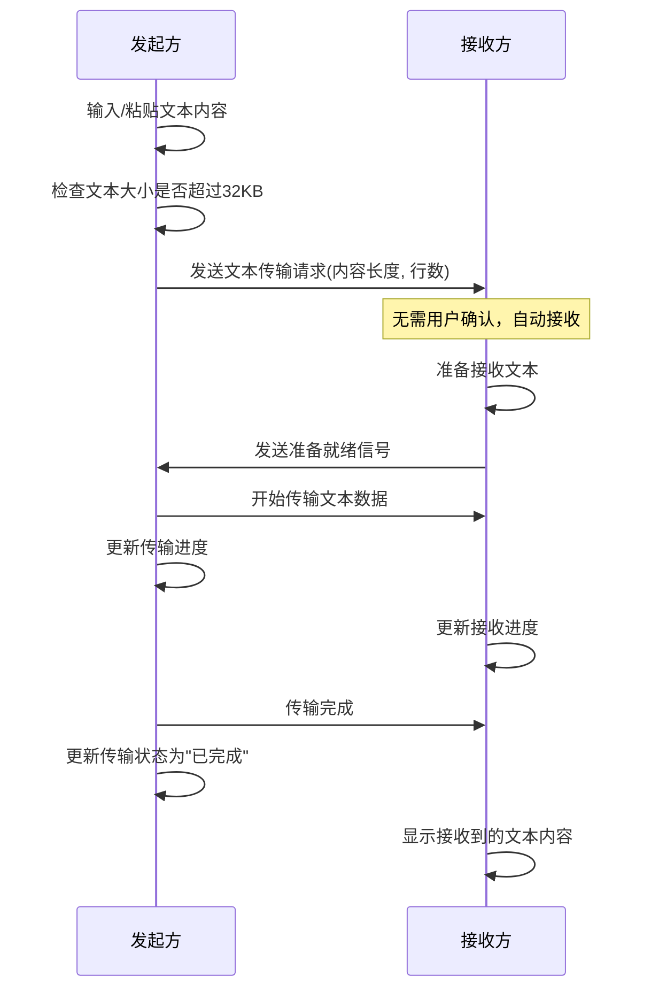

#### 3.3.3 用户界面与交互

**发起方（发送端）操作流程**：

1. 用户在已连接状态下，切换到"文本传输"选项卡
   - **选项卡切换时有平滑过渡动画**
2. 在文本输入框中输入或粘贴文本内容
   - **输入框下方实时显示字符数量和大小**
   - **超过32KB限制时，字符计数变为红色，并显示警告**
   - **发送按钮变为禁用状态**
3. 点击"发送"按钮开始传输
   - **按钮点击后立即变为禁用状态，文本变为"发送中..."**
   - **显示发送进度：已发送行数/总行数、进度条**
   - **输入框变为只读状态，显示灰色背景**
4. 传输完成后：
   - **进度条变为绿色，显示100%**
   - **状态更新为"已发送"**
   - **发送按钮恢复可用，文本恢复为"发送"**
   - **输入框清空并恢复可编辑状态**
5. 传输失败时：
   - **进度条变为红色**
   - **状态更新为"发送失败"**
   - **发送按钮恢复可用，文本恢复为"发送"**
   - **提供"重试"按钮**
   - **输入框保持内容，恢复可编辑状态**

**接收方（接收端）操作流程**：

1. 用户在已连接状态下，自动接收文本
   - **无需用户确认，系统自动接收文本**
   - **接收开始时，状态栏显示"正在接收文本..."通知**
   - **如果当前不在文本传输选项卡，选项卡标题显示提示标记**
2. 接收过程中：
   - **显示接收进度：已接收行数/总行数、进度条**
3. 接收完成后：
   - **进度条变为绿色，显示100%**
   - **状态更新为"已接收"**
   - **自动切换到文本传输选项卡（如果当前不在该选项卡）**
   - **在文本显示区域显示接收到的文本内容**
   - **提供"复制全部"和"保存为文件"按钮**

#### 3.3.4 异常处理

- **文本过大**：
  - 发送方文本内容超过32KB限制时，**发送按钮保持禁用状态**
  - **显示警告提示"文本内容过大（超过32KB），请减少内容或分多次发送"**
  - **字符计数和大小显示为红色**

- **网络中断**：
  - 传输过程中网络中断，显示错误提示"网络连接中断，传输失败"
  - 传输任务状态更新为"失败"
  - **网络恢复后，提供"重试"按钮**

### 3.4 传输历史记录

#### 3.4.1 功能描述

传输历史记录模块负责记录和管理所有文件和文本的传输历史，包括传输时间、类型、大小、状态等信息，方便用户查看和管理历史传输记录。

#### 3.4.2 实现方案

**历史记录存储**：

- 使用本地数据库存储传输历史记录
- 记录传输类型、文件名/文本摘要、大小、传输方向、对方设备信息、传输时间、状态等信息
- 支持按时间、类型、状态等条件筛选和排序

**历史记录管理**：

- 自动记录所有传输操作
- 支持查看详情、重新发送、打开文件、删除记录等操作
- 支持清空历史记录

**历史记录流程**：

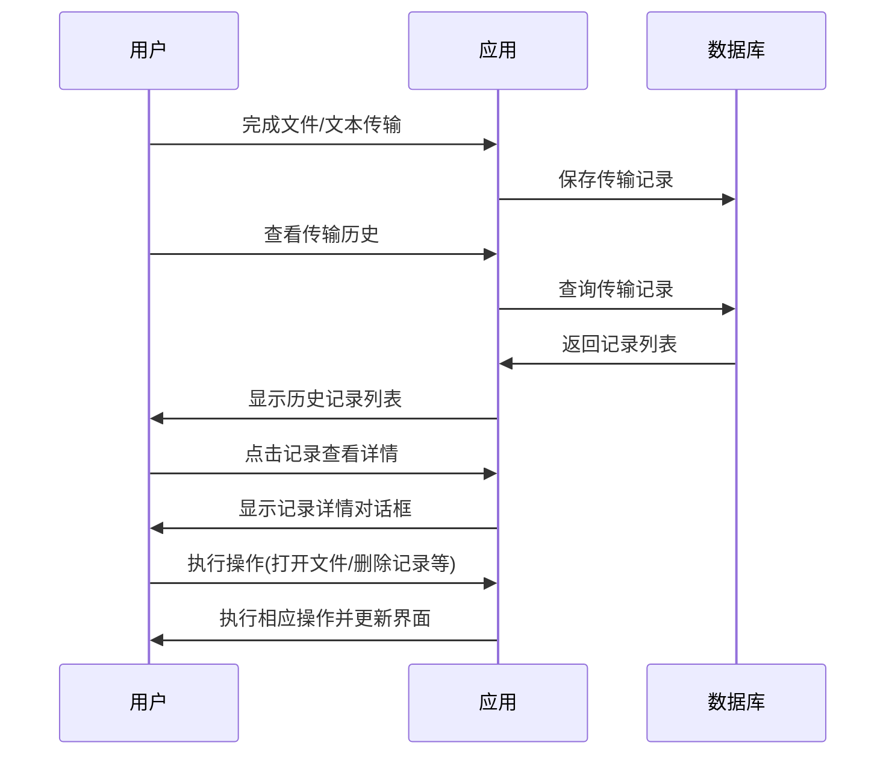

#### 3.4.3 用户界面与交互

**历史记录列表**：

1. 用户点击"传输历史"选项卡或按钮进入历史记录页面
   - **选项卡/按钮点击后有视觉反馈**
   - **页面切换有平滑过渡动画**
2. 历史记录列表显示：
   - 文件名/文本摘要
   - 传输类型图标（文件/文本）
   - 传输方向（发送/接收）
   - 对方设备信息
   - 传输时间
   - 传输状态（已完成/失败）
   - 文件大小/文本行数
3. 用户可以进行以下操作：
   - 点击记录查看详情
     - **点击时记录项背景短暂变色，提供视觉反馈**
     - **弹出详情对话框，显示完整信息**
   - 筛选记录（按类型、状态、时间等）
     - **筛选条件变更时，列表实时更新**
   - 清空历史记录
     - **点击"清空"按钮后，弹出确认对话框"确定要清空所有历史记录吗？此操作不可撤销。"**
     - **确认后，所有记录被删除，显示"历史记录已清空"提示**
     - **取消后，对话框关闭，不执行清空操作**

**记录详情**：

1. 用户点击历史记录项，弹出详情对话框
   - **对话框平滑弹出，带有轻微阴影效果**
2. 详情对话框显示：
   - 完整文件名/文本内容
   - 文件类型/格式
   - 文件大小/文本字符数
   - 传输开始和完成时间
   - 传输用时
   - 平均传输速度
   - 对方设备完整信息
   - 文件保存路径（接收的文件）
3. 用户可以进行以下操作：
   - 打开文件（仅限接收的文件）
     - **点击"打开文件"按钮**
     - **按钮点击后有视觉反馈**
     - **如果文件存在，使用系统默认程序打开**
     - **如果文件不存在，显示错误提示"文件不存在或已被移动/删除"**
     - **提供"浏览文件位置"选项，打开文件所在文件夹**
   - 打开文件位置（仅限接收的文件）
     - **点击"打开位置"按钮**
     - **按钮点击后有视觉反馈**
     - **打开文件所在文件夹并选中该文件**
     - **如果文件夹不存在，显示错误提示"文件夹不存在或已被移动/删除"**
   - 重新发送（仅限发送的文件/文本）
     - **点击"重新发送"按钮**
     - **按钮点击后有视觉反馈**
     - **如果当前已连接设备，直接开始重新发送**
     - **如果当前未连接设备，提示"请先连接设备"**
   - 复制文本内容（仅限文本记录）
     - **点击"复制内容"按钮**
     - **按钮点击后有视觉反馈，文本变为"已复制"**
     - **文本内容被复制到剪贴板**
   - 删除记录
     - **点击"删除"按钮**
     - **按钮点击后有视觉反馈**
     - **弹出确认对话框"确定要删除此记录吗？"**
     - **确认后，记录被删除，对话框关闭，列表更新**
     - **取消后，对话框关闭，不执行删除操作**

#### 3.4.4 异常处理

- **文件不存在**：
  - 用户尝试打开已删除或移动的文件时，显示错误提示"文件不存在或已被移动/删除"
  - **提供"浏览文件位置"和"从历史记录中删除"选项**
  - **"浏览文件位置"点击后打开原文件所在文件夹**
  - **"从历史记录中删除"点击后删除该记录**

- **数据库错误**：
  - 读取或写入历史记录数据库出错时，显示错误提示"无法访问历史记录数据"
  - **提供"重试"和"重置数据库"选项**
  - **"重置数据库"会清空所有历史记录并重建数据库结构**

## 4. 通信协议设计

### 4.1 通信协议概述

Bifrost 虹桥采用基于 Socket 的自定义通信协议，用于设备间的连接建立、消息传递和文件传输。协议设计遵循以下原则：

* **简单性**：协议结构简单明了，易于实现和调试。
* **可靠性**：通过确认机制和超时重试确保消息可靠传递。
* **安全性**：使用配对码验证确保连接的安全性。
* **可扩展性**：预留协议版本字段，便于未来协议升级。

### 4.2 消息格式

所有通信消息采用 JSON 格式，基本结构如下：

```json
{
  "type": "消息类型",
  "data": {
    // 消息数据，根据消息类型不同而不同
  },
  "timestamp": 1234567890,
  "protocolVersion": "1.0"
}
```

消息头部包含以下字段：
* **type**：消息类型，如 CONNECTION_REQUEST、FILE_TRANSFER_REQUEST 等。
* **data**：消息数据，包含与消息类型相关的具体信息。
* **timestamp**：消息发送时间戳，用于消息排序和超时判断。
* **protocolVersion**：协议版本号，用于兼容性检查。

### 4.3 通信端口

为避免与常用服务端口冲突，应用使用以下非标准端口：

* **监听端口**：30080，用于接收连接请求和控制消息。
* **数据端口**：30081，用于文件数据传输。
* **控制端口**：30082，用于传输控制命令。

### 4.4 消息类型

协议定义了以下主要消息类型：

#### 4.4.1 连接管理消息

* **CONNECTION_REQUEST**：连接请求
  ```json
  {
    "deviceName": "发送方设备名称",
    "deviceIp": "发送方IP地址",
    "pairingCode": "6位数字配对码"
  }
  ```

* **CONNECTION_RESPONSE**：连接响应
  ```json
  {
    "accepted": true/false,
    "deviceName": "接收方设备名称",
    "deviceIp": "接收方IP地址",
    "rejectReason": "拒绝原因（仅在rejected=false时存在）"
  }
  ```

* **PAIRING_CONFIRMATION**：配对确认
  ```json
  {
    "confirmed": true/false,
    "rejectReason": "拒绝原因（仅在confirmed=false时存在）"
  }
  ```

* **DISCONNECT**：断开连接
  ```json
  {
    "reason": "断开原因（可选）"
  }
  ```

#### 4.4.2 心跳检测消息

* **PING**：心跳请求
  ```json
  {}  // 无需额外数据
  ```

* **PONG**：心跳响应
  ```json
  {}  // 无需额外数据
  ```

#### 4.4.3 文件传输消息

* **FILE_TRANSFER_REQUEST**：文件传输请求
  ```json
  {
    "fileName": "文件名",
    "fileSize": 文件大小（字节）,
    "fileHash": "文件哈希值",
    "filePath": "文件路径（相对路径）"
  }
  ```

* **FILE_TRANSFER_RESPONSE**：文件传输响应
  ```json
  {
    "accepted": true/false,
    "fileName": "文件名",
    "rejectReason": "拒绝原因（仅在accepted=false时存在）"
  }
  ```

* **FILE_TRANSFER_PROGRESS**：文件传输进度
  ```json
  {
    "fileName": "文件名",
    "bytesTransferred": 已传输字节数,
    "totalBytes": 总字节数,
    "progress": 进度百分比（0.0-1.0）
  }
  ```

* **FILE_TRANSFER_COMPLETE**：文件传输完成
  ```json
  {
    "fileName": "文件名",
    "filePath": "保存路径"
  }
  ```

* **FILE_TRANSFER_CANCEL**：文件传输取消
  ```json
  {
    "fileName": "文件名",
    "reason": "取消原因"
  }
  ```

* **FILE_TRANSFER_ERROR**：文件传输错误
  ```json
  {
    "fileName": "文件名",
    "errorMessage": "错误信息"
  }
  ```

#### 4.4.4 错误消息

* **ERROR**：通用错误消息
  ```json
  {
    "errorCode": "错误代码",
    "errorMessage": "错误描述"
  }
  ```

### 4.5 通信流程

#### 4.5.1 设备连接流程

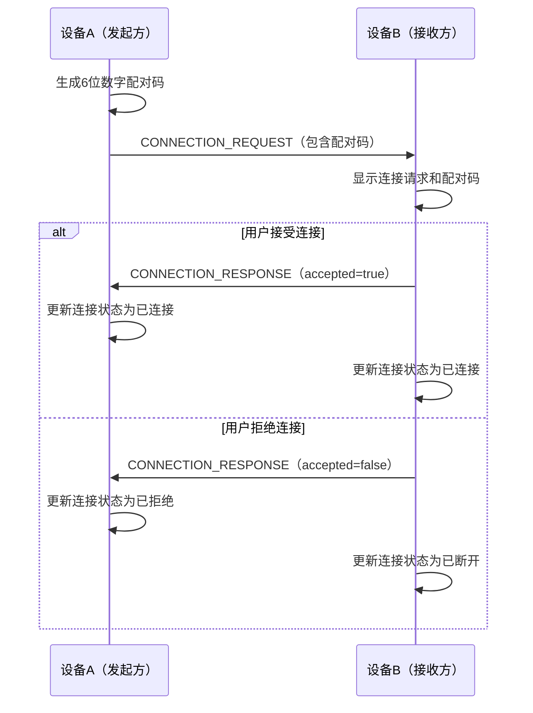

#### 4.5.2 心跳检测流程

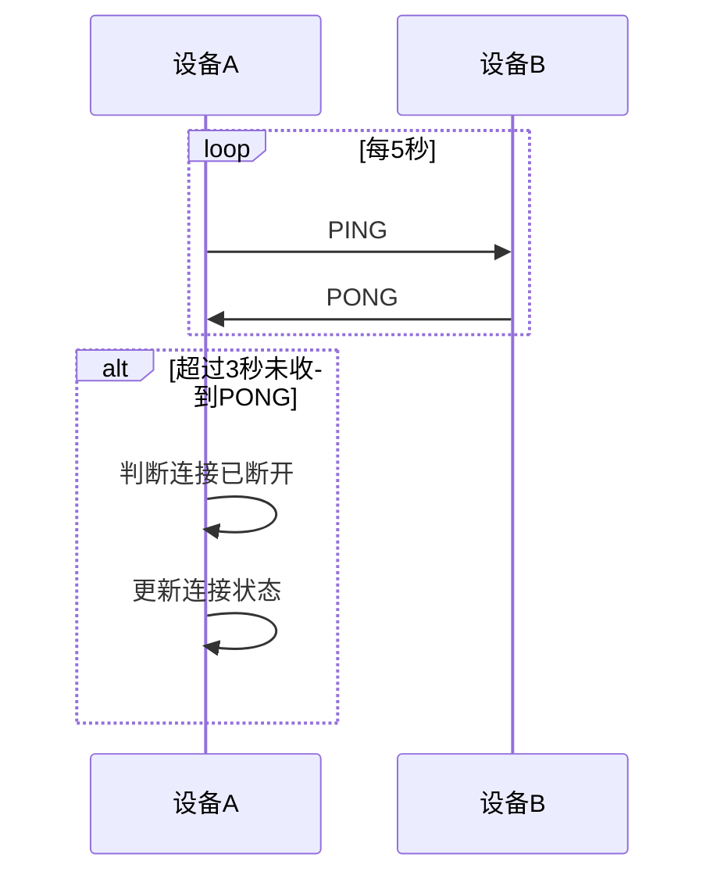

#### 4.5.3 文件传输流程

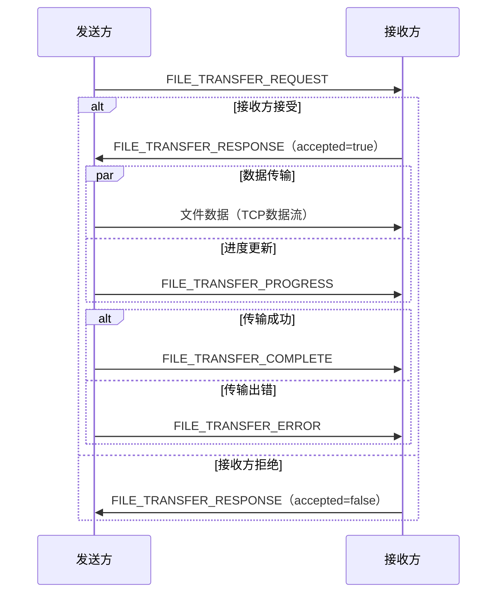

### 4.6 异常处理

#### 4.6.1 连接异常

* **连接超时**：如果在指定时间内（默认10秒）未收到连接响应，发起方将取消连接请求。
* **配对确认超时**：如果在指定时间内（默认30秒）未完成配对确认，连接将自动取消。
* **心跳检测失败**：如果连续3次心跳检测失败，将判定连接已断开。

#### 4.6.2 传输异常

* **传输中断**：如果文件传输过程中连接断开，将自动取消当前传输任务。
* **文件访问错误**：如果无法读取源文件或写入目标文件，将发送 FILE_TRANSFER_ERROR 消息。
* **空间不足**：如果接收方存储空间不足，将拒绝文件传输请求。

### 4.7 安全性考虑

* **局域网限制**：协议仅在局域网内使用，不暴露到公网。
* **配对码验证**：使用随机生成的6位数字配对码，确保连接双方的身份。
* **用户确认**：所有连接请求和文件传输请求都需要用户手动确认。
* **无敏感信息存储**：协议不存储或传输用户的敏感信息。

### 4.8 性能优化

* **消息压缩**：对大型消息进行压缩，减少网络传输量。
* **批量确认**：使用批量确认机制，减少确认消息的数量。
* **连接复用**：复用已建立的连接，避免频繁建立和断开连接。
* **缓冲区优化**：根据网络条件动态调整缓冲区大小，提高传输效率。

## 5. 数据库设计

### 5.1 数据库结构

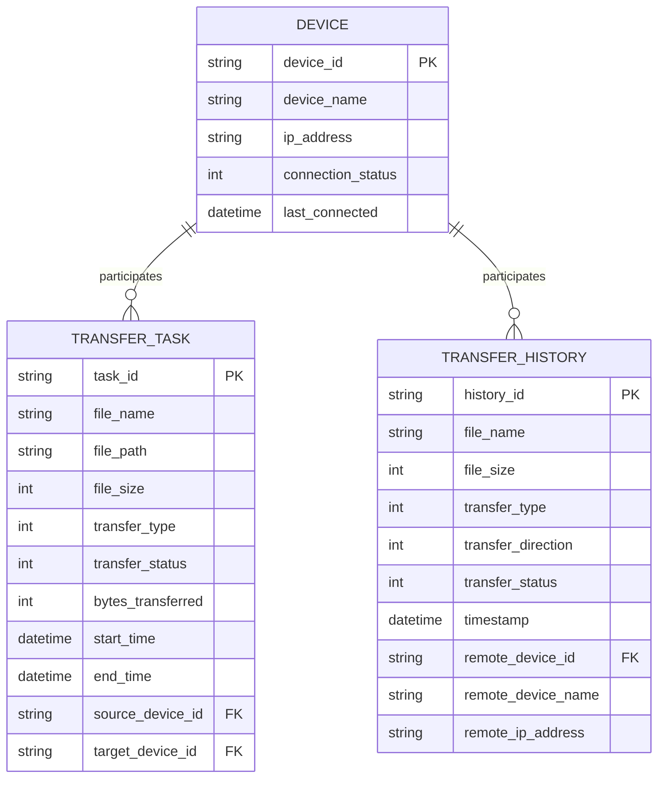

### 5.2 数据模型

#### Device 模型

```dart
class Device {
  final String deviceId;      // 设备唯一标识
  final String deviceName;    // 设备名称
  final String ipAddress;     // IP 地址
  final ConnectionStatus status; // 连接状态
  final DateTime lastConnected; // 最后连接时间
  
  // 构造函数、转换方法等
}

enum ConnectionStatus {
  DISCONNECTED,
  CONNECTING,
  CONNECTED,
  FAILED
}
```

#### TransferTask 模型

```dart
class TransferTask {
  final String taskId;        // 任务唯一标识
  final String fileName;      // 文件名
  final String filePath;      // 文件路径
  final int fileSize;         // 文件大小
  final TransferType type;    // 传输类型
  final TransferStatus status; // 传输状态
  final int bytesTransferred; // 已传输字节数
  final DateTime startTime;   // 开始时间
  final DateTime endTime;     // 结束时间
  final String sourceDeviceId; // 源设备 ID
  final String targetDeviceId; // 目标设备 ID
  
  // 构造函数、转换方法等
}

enum TransferType {
  FILE,
  TEXT,
  DIRECTORY
}

enum TransferStatus {
  PENDING,
  IN_PROGRESS,
  COMPLETED,
  FAILED,
  CANCELED
}
```

#### TransferHistory 模型

```dart
class TransferHistory {
  final String historyId;     // 历史记录唯一标识
  final String fileName;      // 文件名
  final int fileSize;         // 文件大小
  final TransferType type;    // 传输类型
  final TransferDirection direction; // 传输方向
  final TransferStatus status; // 传输状态
  final DateTime timestamp;   // 时间戳
  final String remoteDeviceId; // 远程设备 ID
  final String remoteDeviceName; // 远程设备名称
  final String remoteIpAddress; // 远程设备 IP 地址
  
  // 构造函数、转换方法等
}

enum TransferDirection {
  SEND,
  RECEIVE
}
```

### 5.3 数据流

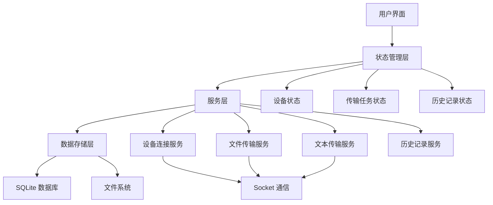

## 6. 安全设计

### 6.1 数据加密

* **传输加密**：使用 TLS/SSL 加密 Socket 通信，确保数据传输安全。
* **配对码验证**：使用随机生成的 6 位数字配对码进行连接验证，防止未授权连接。
* **本地存储加密**：敏感信息（如连接历史）在本地存储时进行加密。

### 6.2 安全防护

* **手动 IP 连接**：采用手动输入 IP 地址的方式，避免自动发现带来的安全风险。
* **连接确认机制**：双方都需要确认连接，防止未经授权的连接请求。
* **传输确认机制**：文件和文本传输前需要接收方确认，防止未经授权的数据传输。
* **超时机制**：连接和传输请求设置超时时间，防止长时间占用资源。

## 7. 性能设计

### 7.1 性能需求

* **传输速度**：在千兆网络环境下，文件传输速度应达到 80MB/s 以上。
* **响应时间**：用户界面操作响应时间应在 100ms 以内。
* **内存占用**：应用内存占用不超过 200MB。
* **CPU 使用率**：正常使用时 CPU 使用率不超过 30%。

### 6.2 性能优化方案

* **文件分块传输**：将大文件分成固定大小的块（如 1MB）进行传输，提高传输效率和稳定性。
* **并发传输控制**：根据网络状况动态调整并发传输数量，避免网络拥塞。
* **缓存机制**：对频繁访问的数据（如设备信息、传输历史）进行缓存，减少数据库访问。
* **延迟加载**：对非关键数据采用延迟加载策略，提高应用启动速度。
* **UI 渲染优化**：使用 Flutter 的性能优化技术，如 const 构造函数、RepaintBoundary 等，减少不必要的重绘。

## 7. 工具类设计

### 7.1 网络工具类

#### 7.1.1 功能描述

网络工具类负责获取设备的网络相关信息，包括本机 IP 地址和设备名称，为设备连接提供基础数据支持。该工具类能够识别并过滤虚拟网卡，确保使用物理网卡的 IP 地址进行通信。

#### 7.1.2 实现方案

**IP 地址获取流程**：

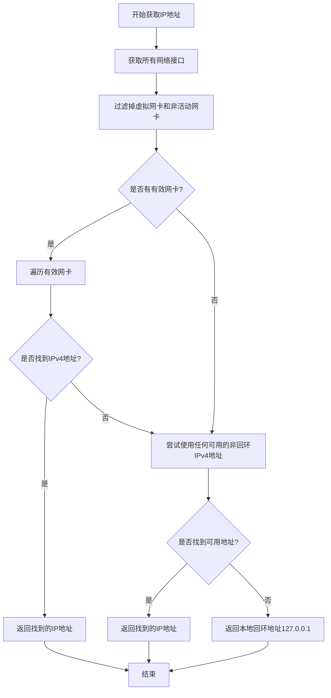

**虚拟网卡过滤策略**：

- 通过网卡名称关键词识别虚拟网卡，包括：
  - VMware：VMware 虚拟机网卡
  - Virtual：通用虚拟网卡
  - WSL：Windows Subsystem for Linux 网卡
  - VirtualBox：VirtualBox 虚拟机网卡
  - Hyper-V：Microsoft Hyper-V 虚拟网卡
  - Loopback：回环网卡
  - Bluetooth：蓝牙网卡
  - Docker：Docker 容器网络
  - VPN：虚拟专用网络
  - TAP/TUN：虚拟网络设备

**设备名称获取**：

- 使用 Platform.localHostname 获取操作系统的主机名
- 在获取失败时返回"未知设备"作为默认值

#### 7.1.3 异常处理

- **网络接口获取失败**：
  - 记录错误日志
  - 返回本地回环地址 127.0.0.1 作为默认 IP 地址
  - 返回"未知设备"作为默认设备名称

- **无有效网卡**：
  - 尝试使用任何可用的非回环 IPv4 地址
  - 如果仍未找到，返回本地回环地址 127.0.0.1

- **设备名称获取失败**：
  - 记录错误日志
  - 返回"未知设备"作为默认值

## 8. 总结

Bifrost 虹桥跨平台文件传输工具的技术设计方案基于 Flutter 框架，采用分层架构和面向接口的设计模式，实现了设备连接管理、文件传输、文本传输和传输历史记录等核心功能。

该方案具有以下优势：

* **高效传输**：通过 Socket 通信和文件分块传输，实现高效的文件和文本传输。
* **安全可靠**：采用手动 IP 连接、配对码验证和连接确认机制，确保传输安全。
* **易用性**：提供简洁直观的用户界面，操作简单易上手。
* **可扩展性**：基于接口的设计模式，便于功能扩展和技术升级。
* **网络适应性**：智能识别物理网卡，过滤虚拟网卡，确保在局域网内的正常通信。

通过本设计方案的实施，Bifrost 虹桥将为用户提供一个高效、安全、易用的局域网文件传输工具，满足个人用户、开发者和小型团队在局域网内跨平台设备间快速共享文件的需求。 