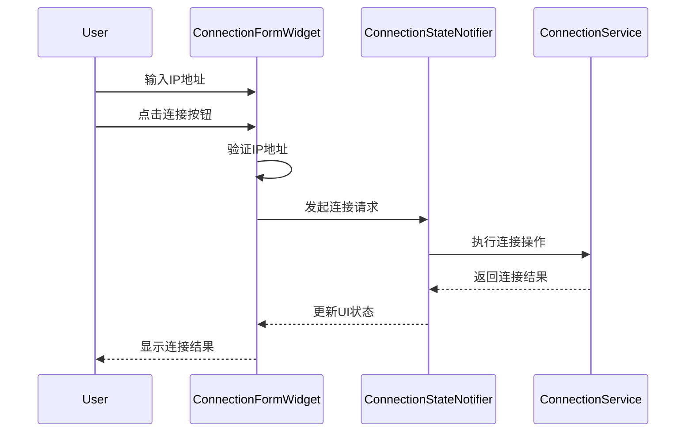
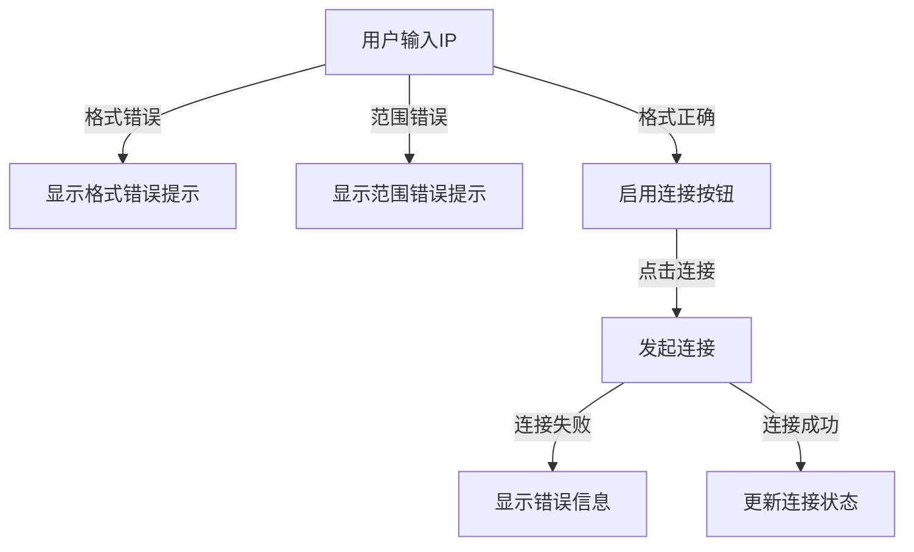

# 连接UI更新技术方案设计文档

## 1. 目的

本文档旨在为开发团队提供清晰的技术实现指导，以完成连接UI的优化更新。主要涉及UI布局的调整，包括将IP地址输入框、文本和连接按钮放置在同一行，优化空间利用率。

## 2. 文档结构

### 概述

#### 项目背景
当前连接UI采用垂直布局，IP地址输入框宽度过长，导致空间利用率不高。需要通过调整布局和组件尺寸来优化用户界面。

#### 项目目标
1. 优化连接UI的布局，提高空间利用率
2. 保持现有功能的完整性和可用性
3. 确保UI调整不影响用户体验

#### 技术选型
- Flutter Material Design
- Provider状态管理
- Flutter单元测试框架

### 详细设计

#### 功能模块

##### 模块划分
1. 连接表单组件（ConnectionFormWidget）
   - 负责显示连接相关的UI元素
   - 处理用户输入和连接操作
   - 显示连接状态和错误信息

##### 模块交互


##### 异常处理流程


#### 数据设计

##### 数据模型
保持现有的数据模型不变：
- ConnectionModel：连接状态和信息
- DeviceInfoModel：设备信息

##### 数据流
1. 用户输入 -> IP地址验证 -> 连接请求
2. 连接状态更新 -> UI状态更新 -> 界面刷新

#### 类设计

##### ConnectionFormWidget 类更新
```dart
class ConnectionFormWidget extends StatefulWidget {
  @override
  Widget build(BuildContext context) {
    return Row(
      children: [
        Text('连接到设备'),
        SizedBox(width: 16),
        Expanded(
          flex: 2,
          child: TextFormField(
            // IP地址输入框
          ),
        ),
        SizedBox(width: 16),
        ElevatedButton(
          // 连接按钮
        ),
      ],
    );
  }
}
```

### 其他

#### 安全性设计
- 保持现有的IP地址验证逻辑
- 确保错误提示信息的准确性

#### 性能优化
- 使用Expanded widget控制输入框宽度
- 避免不必要的重建

#### 单元测试
1. UI布局测试
```dart
testWidgets('连接UI元素应在同一行显示', (WidgetTester tester) async {
  await tester.pumpWidget(MaterialApp(home: ConnectionFormWidget()));
  
  final rowFinder = find.byType(Row);
  expect(rowFinder, findsOneWidget);
  
  final textFinder = find.text('连接到设备');
  final textFieldFinder = find.byType(TextFormField);
  final buttonFinder = find.byType(ElevatedButton);
  
  expect(textFinder, findsOneWidget);
  expect(textFieldFinder, findsOneWidget);
  expect(buttonFinder, findsOneWidget);
});
```

2. 功能测试
```dart
testWidgets('IP地址验证和连接功能应正常工作', (WidgetTester tester) async {
  await tester.pumpWidget(MaterialApp(home: ConnectionFormWidget()));
  
  await tester.enterText(find.byType(TextFormField), '192.168.1.1');
  await tester.tap(find.byType(ElevatedButton));
  await tester.pump();
  
  // 验证连接状态更新
  expect(find.text('连接中...'), findsOneWidget);
});
```

#### 风险评估
1. 潜在风险
   - UI调整可能影响错误提示的显示
   - 输入框宽度变化可能影响长IP地址的显示
   - 现有测试用例需要更新

2. 应对措施
   - 确保错误提示在新布局中正确显示
   - 测试各种长度的IP地址输入
   - 更新并补充测试用例 