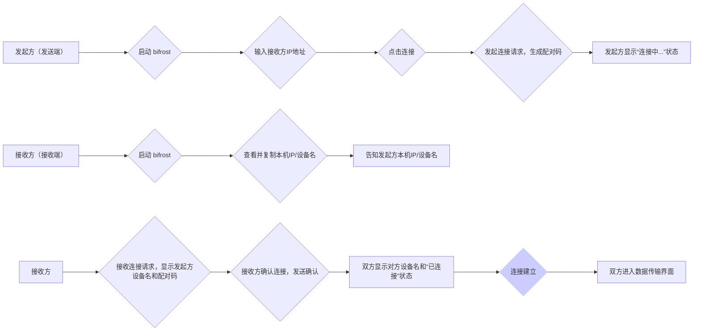
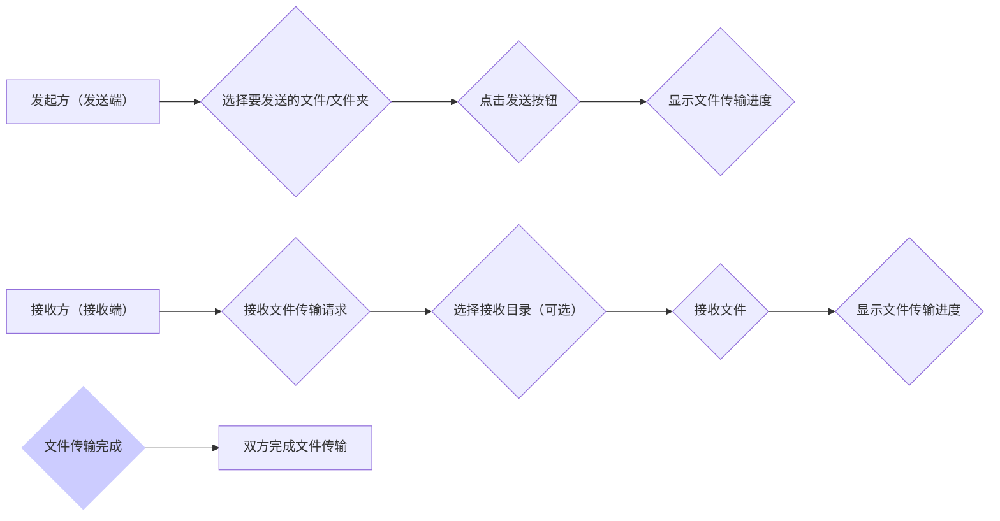
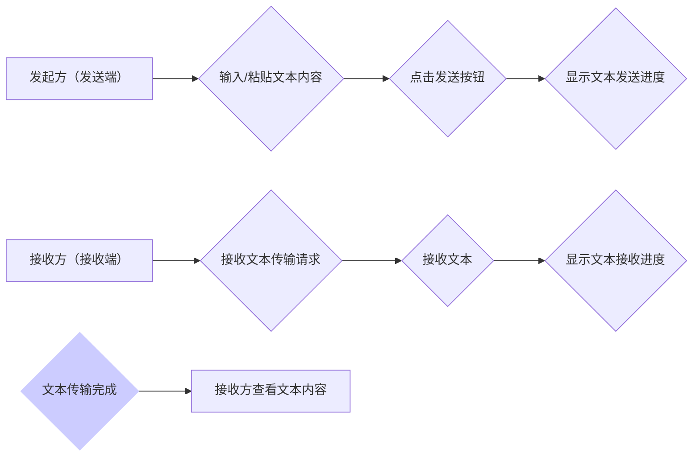

# **bifrost（虹桥）** 产品需求文档

## 1. 产品概述

本章简要介绍bifrost（虹桥）的基本信息、背景、目标用户和核心功能。

### 1.1 产品名称

bifrost（虹桥）

### 1.2 产品背景

在日常工作和生活中，用户经常需要在不同操作系统（Windows, Linux）的设备之间共享文件。例如，设计师可能需要在Windows电脑上完成的设计稿快速传输到Linux服务器进行部署，开发者需要在Linux服务器上编辑的代码同步到Windows笔记本进行演示。

现有的文件传输方案，如使用U盘、邮件、云盘等，存在操作繁琐、速度慢、安全性较低等问题。尤其在局域网环境下，用户期望有一款操作简便、传输速度快、安全可靠的工具来高效地进行文件共享。

### 1.3 产品目标

bifrost（虹桥）旨在解决用户在局域网内跨平台设备间快速、便捷、安全地共享文件的需求。通过提供简洁的用户界面和高效的传输协议，帮助用户提升工作效率，优化文件共享体验。

### 1.4 目标用户

- **个人用户:**
    - 拥有多台电脑，例如同时使用Windows和Linux系统的用户。
    - 需要在家中或小型办公室内不同设备间共享照片、音乐、文档等文件。
    - 对文件传输速度和易用性有较高要求的用户。
- **开发者/技术人员:**
    - 需要在不同操作系统服务器和工作站之间同步代码、配置文件、测试数据等。
    - 经常需要在Windows、Linux等开发环境之间切换。
    - 需要与他人共享代码片段、日志文件等文本信息。
    - 对局域网传输效率和稳定性有较高要求的用户。
- **小型团队/工作室:**
    - 团队成员使用不同操作系统的设备协同工作。
    - 需要在团队内部快速共享设计稿、项目文档、素材资源等大文件和文本信息。
    - 需要保证文件传输的安全性和便捷性。

### 1.5 用户痛点

- **操作繁琐:** 使用U盘、邮件、云盘等方式进行局域网文件共享，步骤繁琐，效率低下。
- **速度慢:**  传统共享方式，尤其对于大文件传输，速度慢，耗时久。
- **平台限制:** 不同操作系统间的文件共享兼容性问题，例如Windows和Linux共享权限设置复杂。
- **安全性:**  使用公共云盘可能存在隐私泄露风险，局域网共享更注重本地安全。
- **设备查找困难:** 在局域网内查找其他设备进行文件共享比较麻烦。
- **代码/文本共享不便:** 开发者在需要快速共享代码片段或文本信息时，缺少便捷工具。

### 1.6 主要功能

- **跨平台文件和文本传输:** 支持Windows和Linux操作系统，实现文件、图片、音乐、文本、代码等多种类型数据的局域网快速传输。
- **设备连接管理:**
    - **手动IP连接:** 用户手动输入目标设备IP地址进行连接，保证连接的准确性和安全性。
    - **IP信息显示与复制:**  界面显示当前设备的IP地址和设备名称，提供一键复制IP地址功能，方便用户告知其他设备进行连接。
    - **连接状态显示:**  界面实时显示当前连接状态，包括**未连接、连接中、已连接、连接失败**等状态。
    - **已连接设备信息:**  界面显示已连接的**接收方**设备名称等信息。
    - **连接二次确认:**  双方在连接建立前进行二次确认，确保连接安全。
- **文件/文件夹发送:**  用户可以选择单个或多个文件，以及文件夹进行发送。
- **文本发送/接收:**  支持文本内容的直接发送和接收，方便代码片段、文本信息快速共享。
- **传输进度显示:**  实时显示文件和文本传输进度，包括已传输大小/行数、总大小/行数、传输速度等。
- **接收目录选择:**  文件接收方可以自定义文件接收目录。
- **简单的用户界面:**  提供简洁直观的用户界面，操作简单易上手。

## 2. 功能需求

本章详细描述bifrost（虹桥）的具体功能和预期实现方式，并使用流程图进行可视化展示。

### 2.1 功能概述

bifrost（虹桥）的核心功能是实现局域网内跨平台设备间的文件和文本快速传输。主要功能模块包括：设备连接管理、文件发送、文本发送、文件接收、文本接收、IP信息显示、**连接状态显示、已连接设备信息显示**。

### 2.2 用户场景

**场景一：个人用户跨设备文件共享**

小明在家中使用Windows电脑下载了一部电影，想要在客厅的Linux系统的电视盒子上观看。他可以使用bifrost（虹桥），将电影文件从Windows电脑快速传输到电视盒子，无需U盘拷贝，方便快捷。

**场景二：开发者代码同步**

程序员小李在Linux服务器上修改了代码，需要同步到Windows笔记本进行演示。他可以使用bifrost（虹桥），将代码文件夹从Linux服务器发送到Windows笔记本，保持开发环境和演示环境的代码一致。

**场景三：设计师团队素材共享**

设计团队小组成员使用不同的操作系统，设计师小张使用Windows工作站完成了设计稿，需要共享给使用Linux系统的UI设计师小王进行界面优化。他们可以使用bifrost（虹桥），快速将设计稿共享给团队成员，提高团队协作效率。

**场景四：开发者共享代码块**

开发者小王在调试代码时遇到了问题，需要向同事小李寻求帮助。他可以使用bifrost（虹桥）的文本发送功能，将代码片段直接发送给小李，方便快捷地进行代码交流和问题定位。

### 2.3 功能流程

#### 2.3.1 设备连接流程

**流程描述:**

1. **发起方（发送端）** 启动 bifrost（虹桥）。
2. **发起方** 在界面上输入 **接收方（接收端）** 的IP地址。
3. **发起方** 点击连接按钮。
4. **bifrost（虹桥）** 向接收方发送连接请求，**发起方生成配对码**。
5. **发起方** 界面**显示“连接中...”状态**。
6. **接收方（接收端）** 启动 bifrost（虹桥）。
7. **接收方** 在界面上查看并复制本机IP地址和设备名称。
8. **接收方** 通过口头、IM等方式告知 **发起方** 自己的IP地址和设备名称。
9. **接收方** 接收到连接请求，界面弹出连接二次确认对话框，**显示发起方设备名称和相同的配对码**。
10. **接收方** 确认连接，并向发起方发送连接确认信息。
11. **发起方和接收方** 界面**显示对方设备名称和“已连接”状态**。
12. **bifrost（虹桥）** 建立连接。
13. **连接建立成功**，双方进入数据传输界面，**界面显示已连接设备信息和“已连接”状态**。

**界面更新:**

* **连接状态显示:**  在设备连接和数据传输界面，都需要实时显示当前连接状态，例如“未连接”、“连接中...”、“已连接”、“连接失败”等，方便用户了解连接情况。
* **已连接设备信息:**  成功建立连接后，在数据传输界面上方或侧边栏等位置，显示已连接的接收方设备名称，方便用户确认当前连接的设备。

**异常处理:**

* **连接超时:** 若发起方在一定时间内未收到接收方确认，连接请求超时，双方界面提示连接失败。
* **IP地址错误:** 若发起方输入IP地址错误，无法连接到接收方，发起方界面提示连接失败，IP地址错误。
* **连接被拒绝:** 接收方在二次确认时拒绝连接，连接建立失败，双方界面提示连接已拒绝。

**角色关系:**

- **发起方 (发送端):**  **主动发起连接请求的一方。需要输入接收方的IP地址**，并进行二次确认。**负责生成配对码。**  界面显示连接状态和已连接的接收方设备信息。
- **接收方 (接收端):**  **被动接受连接请求的一方。需要告知发起方自己的IP地址和设备名称**，并进行二次确认。界面显示连接状态和已连接的发起方设备信息。

#### 2.3.2 文件发送流程

**流程描述:**

1. **发起方（发送端）** 在文件传输界面选择要发送的文件或文件夹。
2. **发起方** 点击发送按钮。
3. **发起方** 界面显示文件传输进度，例如：文件名、已传输大小、总大小、传输速度、剩余时间等。
4. **接收方（接收端）** 接收到文件传输请求，界面弹出提示。
5. **接收方** 可以选择自定义文件接收目录（若不选择，则使用默认目录）。
6. **接收方** 确认接收文件，开始接收文件。
7. **接收方** 界面显示文件传输进度，与发起方同步。
8. **文件传输完成**，双方界面提示文件传输完成。
9. **双方** 完成本次文件传输操作。

**异常处理:**

* **文件读取错误:** 发起方在读取文件时发生错误，例如文件不存在、权限不足等，发送失败，发起方界面提示文件读取错误。
* **网络中断:** 文件传输过程中网络连接中断，传输失败，双方界面提示网络连接中断，并提供重试机制。
* **磁盘空间不足:** 接收方磁盘空间不足，无法完整接收文件，传输失败，接收方界面提示磁盘空间不足。

**角色关系:**

- **发起方 (发送端):**  主动选择文件并发送的一方，监控发送进度。界面显示连接状态和已连接的接收方设备信息。
- **接收方 (接收端):**  被动接收文件的一方，可选择接收目录，监控接收进度。界面显示连接状态和已连接的发起方设备信息。

#### 2.3.3 文本发送流程

**流程描述:**

1. **发起方（发送端）** 在文本发送界面输入或粘贴要发送的文本内容。
2. **发起方** 点击发送按钮。
3. **发起方** 界面显示文本发送进度，例如：已发送行数、总行数等。
4. **接收方（接收端）** 接收到文本传输请求，界面弹出提示。
5. **接收方** 确认接收文本，开始接收文本。
6. **接收方** 界面显示文本接收进度，与发起方同步。
7. **文本传输完成**，双方界面提示文本传输完成。
8. **接收方** 可以在文本接收界面查看接收到的文本内容。

**异常处理:**

* **网络中断:** 文本传输过程中网络连接中断，传输失败，双方界面提示网络连接中断，并提供重试机制。
* **文本内容过大:**  若文本内容过大，超出软件处理能力，发送失败，发起方界面提示文本内容过大。

**角色关系:**

- **发起方 (发送端):**  主动输入/粘贴文本并发送的一方，监控发送进度。界面显示连接状态和已连接的接收方设备信息。
- **接收方 (接收端):**  被动接收文本的一方，监控接收进度，并查看接收到的文本内容。界面显示连接状态和已连接的发起方设备信息。

### 2.4 前置条件

- **设备已连接到同一局域网:**  发起方和接收方设备必须连接到同一个局域网环境下。
- **双方设备已安装 bifrost（虹桥）:**  发起方和接收方设备都需要安装并启动 bifrost（虹桥）软件。
- **发起方已知晓接收方IP地址和设备名:**  发起方需要通过接收方告知或其他途径获取到接收方的IP地址和设备名称。

### 2.5 后置条件

- **文件/文本成功传输到接收方设备:**  选定的文件或文本已完整、准确地传输到接收方设备。
- **双方设备保持连接状态或断开连接:**  数据传输完成后，双方设备可以继续保持连接状态以便后续传输，也可以选择断开连接。

## 3. 非功能性需求

本章概述bifrost（虹桥）在性能、可靠性、易用性等方面的非功能性需求。

### 3.1 性能需求

- **传输速度:**  在理想局域网环境下，文件传输速度应尽可能接近理论上限，例如千兆网络应达到接近100MB/s的传输速度。
- **响应速度:**  用户操作界面响应迅速，例如点击按钮、选择文件等操作应立即响应。

### 3.2 可靠性需求

- **稳定性:**  软件应稳定运行，不易崩溃，长时间运行不出现异常。
- **传输可靠性:**  保证文件和文本传输的完整性和准确性，避免数据损坏或丢失。
- **错误处理:**  在网络异常、连接失败等情况下，能够给出友好的错误提示，并提供重试机制。

### 3.3 易用性需求

- **界面简洁:**  用户界面设计应简洁直观，功能布局合理，易于理解和操作。
- **操作便捷:**  用户操作流程应简洁明了，减少操作步骤，提高操作效率。
- **提示明确:**  软件运行过程中，应提供明确的操作提示和状态反馈，帮助用户理解当前状态和下一步操作。
- **跨平台一致性:**  在Windows和Linux平台下，用户界面和操作体验应尽可能保持一致，降低用户学习成本。

### 3.4 安全性需求

- **局域网安全:**  数据传输仅在局域网内进行，保障本地网络环境下的数据安全。
- **手动IP连接 & 二次确认:**  采用手动输入IP地址连接方式，并增加二次确认环节，避免未经授权的设备接入，提高连接安全性。