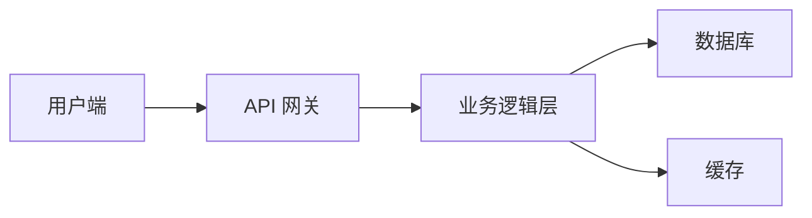

# 技术方案设计文档

## 1. 文档概述

简要说明此技术方案的背景、目的及范围。

### 1.1 目标

定义该技术方案的目标及预期效果。

## 2. 系统架构设计

描述系统的整体架构和主要技术组件。

### 2.1 系统架构图

使用Mermaid绘制系统架构图，展示主要模块及其相互关系。示例：

### 2.2 技术栈

列出系统中使用的主要技术栈和工具，如编程语言、框架、数据库、云服务等。

### 2.3 关键技术

详细描述本方案中的关键技术，包括使用的技术解决方案、工具以及理由。

## 3. 主要功能设计

描述系统的主要功能模块及其详细设计。

### 3.1 功能1

- **功能描述**：简要说明该功能的核心作用。
- **实现方案**：详细描述实现该功能的技术方案及实现步骤。
- **接口设计**：列出该功能的API接口、输入输出参数及数据格式。

### 3.2 功能2

- **功能描述**：简要说明该功能的核心作用。
- **实现方案**：详细描述实现该功能的技术方案及实现步骤。
- **接口设计**：列出该功能的API接口、输入输出参数及数据格式。

### 3.3 功能3

[依照需求继续添加功能模块]

## 4. 数据库设计

描述系统中涉及的数据库设计。

### 4.1 数据库结构

展示数据库表结构图，说明每个表的字段及其关系。

### 4.2 数据模型

详细描述数据库中使用的实体模型、字段及约束。

### 4.3 数据流

阐述数据在系统中的流动和存储过程。

## 5. 安全设计

描述系统中涉及的安全机制和技术措施。

### 5.1 数据加密

描述敏感数据的加密处理，包括存储和传输加密。

### 5.2 安全防护

列出系统中为防止攻击和安全漏洞所采取的防护措施。

## 6. 性能设计

描述系统的性能要求和优化方案。

### 6.1 性能需求

列出系统的响应时间、吞吐量等性能要求。

### 6.2 性能优化方案

描述如何通过架构、算法或技术手段优化系统性能。

## 7. 总结

简要总结技术方案，重申方案的优势与可行性。